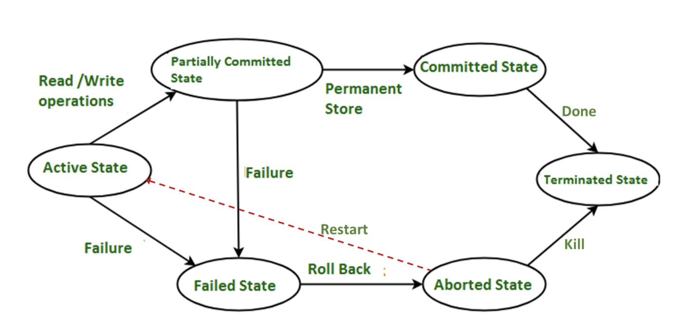
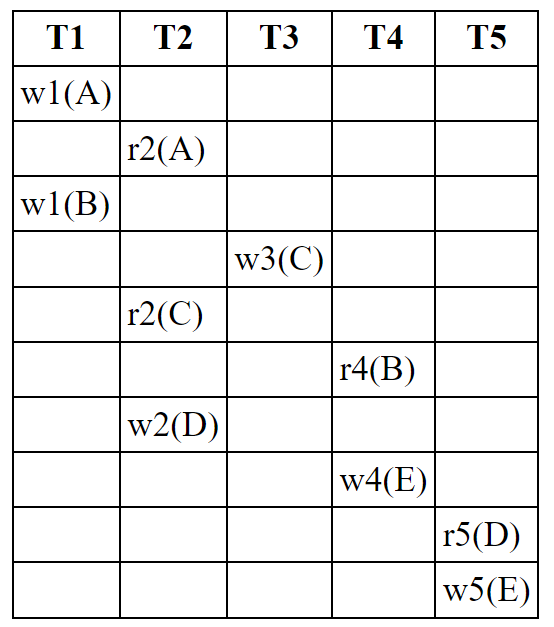
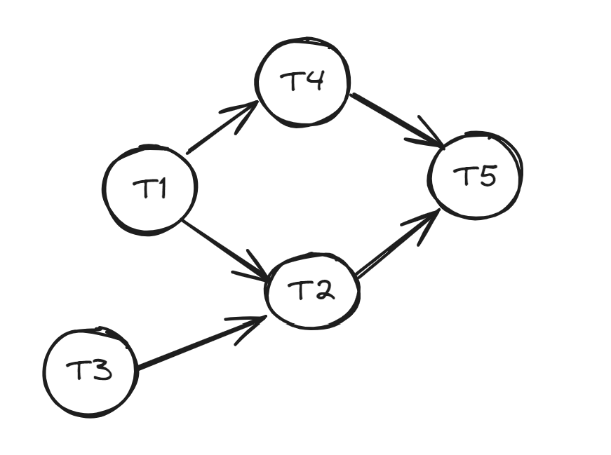
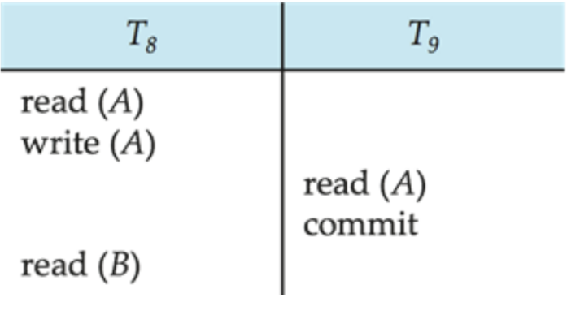

<style scoped>
    h1 {
        text-align: center;
        font-size: 70px
    }
</style>

<style>
/* Add "Page" prefix and total page number */
section::after {
  content: 'Page ' attr(data-marpit-pagination) ' / ' attr(data-marpit-pagination-total);
  font-weight: bold;
  padding: 1px;
  color: black;
  background-color: aliceblue;
}

section {
  width: 1280px;
  height: 720px;
  background-color: #fff;
  color: #333;
}

footer {
    background-color: #fff;
    color: #333;
    width: 1280px;
    height: 35px;
    font-weight: bold;
    font-size: 25px;
    background-color: aliceblue;
    padding: 1px;
}
</style>


# DBMS WEEK 10

---

# Transaction

- A transaction is a unit of program execution that accesses and, possibly updates,
various data items.

<br>

Two main issues to deal with:

- Failures of various kinds, such as hardware failures and system crashes
- **Concurrent execution** of multiple transactions

<br> <br>

---


<style>
    .container {
        display: flex;
        flex-wrap: wrap;
        justify-content: space-between;
    }
    
    .column_1 {
        width: 50%;
    }

    .column_2 {
        width: 40%; 
    }
</style>


<div class="container">
    <div class="column_1">

# ACID Properties

<br>

- **Atomicity** - All or Nothing Transactions
- **Consistency** - Guarantees committed transaction state
- **Isolation** - Transactions are independent (Ensures Concurrent Transaction)
- **Durability** - Committed Data is never lost


</div>
<div class="column_2">


##### Transaction to transfer $50 from account A to account B:
<center style="color:darkblue;">

||T1|
|-| - |
|1| read(A) |
|2| A := A − 50 |
|3| write(A) |
|4| read(B) |
|5| B := B + 50 |
|6| write(B) |

</center>
</div>
</div>

---

<style scoped>
    .container {
        display: flex;
        flex-wrap: wrap;
        justify-content: space-between;
    }
    
    .column_1 {
        width: 40%;
    }

    .column_2 {
        width: 60%; 
    }
</style>


<div class="container">
    <div class="column_1">

# Transaction States

Every transaction can be in one of the following states

- Active
- Partially committed
- Failed
- Aborted
- Committed 
- Terminated 
</div>

<div class="column_2">



</div>
</div>

---

# Schedule

A sequence of instructions that specify the chronological order in which instructions of concurrent transactions are executed.
- A schedule for a set of transactions must consist of all instructions of those
transactions
- Must preserve the order in which the instructions appear in each individual
transaction

<br> <br> <br> <br>

---

# Serializability

- Each Transaction preserves database consisitency
- A schedule is serializable if it it is equivalent serial schedule

<br>

Types of Serializability

1. **Conflict Serializability**
2. **View Serializability**

---

# Example of Schedule and Serializable

Let T1 and T2 be the transactions. The following schedule is not a serial schedule, but it is equivalent to Schedule 1


---


# Conflicting Instructions

<br>

Let $I_i$ and $I_j$ be two Instructions from transactions $T_i$ and $T_j$ respectively

<br>

- $I_i$ = read(Q), $I_j$ = read(Q) $\space$ - $\space$ $I_i$ and $I_j$  don’t conflict

- $I_i$ = read(Q), $I_i$ = write(Q) $\space$ - $\space$ They conflict

- $I_i$ = write(Q), $I_j$ = read(Q) $\space$ - $\space$ They conflict

- $I_i$ = write(Q), $I_j$ = write(Q) $\space$ - $\space$ They conflict

<br>

---

# Conflict Serializable

- If a schedule $S$ can be transformed into a schedule $S^{'}$ by a series of swaps of non-conflicting instructions, we say that $S$ and $S^{'}$ are conflict equivalent.
- We say that a schedule S is conflict serializable if it is conflict equivalent to a serial schedule.

## **Note**

- All conflict-serializable schedules are equivalent serializable but the reverse is not true.

---

# Example

Schedule 3 can be transformed into Schedule 6, a serial schedule where T2 follows T1, by a series of swaps of non-conflicting instructions:

- Swap T1.read(B) and T2.write(A)
- Swap T1.read(B) and T2.read(A)
- Swap T1.write(B) and T2.write(A)
- Swap T1.write(B) and T2.read(A)

---

# Example (continued)


---

# Precedence Graph

- A direct graph where the vertices are the transactions (names)

- We draw an arc from $T_i$ to $T_j$ if the two transactions conflict, and $T_i$ accessed the data item on which the conflict arose earlier.

## **Note**

- A schedule is conflict serializable if and only if its precedence graph is **acyclic**
- If precedence graph is acyclic, the serializability order can be obtained by a **topological sorting** of the graph

---

<style scoped>
    .container {
        display: flex;
        flex-wrap: wrap;
        justify-content: space-between;
    }
    
    .column_1 {
        width: 60%;
    }

    .column_2 {
        width: 40%; 
    }
</style>

# Example

Consider the following schedule:
w1(A), r2(A), w1(B), w3(C),r2(C),r4(B), w2(D), w4(E), r5(D), w5(E)


<div class="container">
    <div class="column_1">



</div>

<div class="column_2">



</div>
</div>


---

# Recovery

- Serializability helps to ensure Isolation and Consistency of a schedule.

<br>

If the system fails in intermediate steps of the transaction,
- Leads to inconsistent state
- Need to rollback update of A

This is known as **Recovery**

<br> <br>

---

# Recoverable Schedules

If a transaction $T_j$ reads a data item previously written by a transaction $T_i$, then the commit operation of $T_i$ must appear before the commit operation of $T_j$.

<style scoped>
    .container {
        display: flex;
        flex-wrap: wrap;
        justify-content: space-between;
    }
    
    .column_1 {
        width: 50%;
    }

    .column_2 {
        width: 50%; 
    }
</style>


<div class="container">
    <div class="column_1">



</div>

<div class="column_2">

- The following schedule is not recoverable if T9 commits immediately after the read(A) operation
- If T8 should abort, T9 would have read (and possibly shown to the user) an inconsistent database state.

</div>
</div>

---

# Cascading Rollbacks

- A single transaction failure leads to a series of transaction rollbacks.

<style scoped>
    .container {
        display: flex;
        flex-wrap: wrap;
        justify-content: space-between;
    }
    
    .column_1 {
        width: 50%;
    }

    .column_2 {
        width: 50%; 
    }
</style>

<div class="container">
    <div class="column_1">


</div>

<div class="column_2">
<br>

- The following schedule is recoverable
- If T10 fails, T11 and T12 must also be rolled back
- Can lead to the undoing of a significant amount of work

</div>
</div>

---

# Cascadeless Schedules

- For each pair of transactions $T_i$ and $T_j$ such that $T_j$ reads a data item previously written by $Ti$, the commit operation of $T_i$ appears before the read operation of $T_j$

<style scoped>
    .container {
        display: flex;
        flex-wrap: wrap;
        justify-content: space-between;
    }
    
    .column_1 {
        width: 50%;
    }

    .column_2 {
        width: 50%; 
    }
</style>

<div class="container">
    <div class="column_1">


</div>

<div class="column_2">
<br> 

- Every cascadeless schedule is also recoverable

<br> 

- The shown schedule is **not cascadeless**
</div>
</div>


---

# TCL (Transaction Control Language)

- ```COMMIT``` - To save the changes
- ```ROLLBACK``` - To roll back the changes
- ```SAVEPOINT``` - Creates points within the groups of transactions in which to ROLLBACK
- ```SET TRANSACTION``` - Places a name on a transaction


---

<style scoped>
    .container {
        display: flex;
        flex-wrap: wrap;
        justify-content: space-between;
    }
    
    .column_1 {
        width: 60%;
    }

    .column_2 {
        width: 40%; 
    }
</style>

<br>

# Example

<div class="container">
    <div class="column_1">

<br> 

```sql
SQL> SAVEPOINT SP1;
SQL> UPDATE Employee SET EName="Janie" WHERE EID="E06";
SQL> SAVEPOINT SP2;
SQL> DELETE FROM Employee WHERE EID='E02';
SQL> SAVEPOINT SP3;
SQL> UPDATE Employee SET EName="Raina" WHERE EID="E04";
SQL> ROLLBACK TO SP1
```

</div>

<div class="column_2">
<center>

|EID|EName|
|---|-----|
|E01|Arthur|
|E02|Raina|
|E03|Meena|
|E04|Arthur|
|E06|Joey|

</center>
</div>
</div>

<br><br>

---

# View Serializability

Let $S$ and $S^{'}$ be two schedules with the same set of transactions.$S$ and $S^{'}$ view equivalent if the following conditions met

1. **Initial Read**
    - In $S$, $T_i$ reads initial value of Q, then in $S^{'}$ also $T_i$ also read initial value of Q.
2. **Write-Read Pair**
    - If in schedule $S$, $T_i$ executes read(Q), and that value was produced by transaction $T_j$(if any), in schedule $S^{'}$ also transaction $T_i$ must read the value of Q that was produced by the same write(Q) operation of transaction $T_j$ 
3. **Final write** 
    - The transaction (if any) that performs the final write(Q) operation in schedule $S$ must also perform the final write(Q) operation in schedule $S^{'}$

---

# View Serializability (Continued)

- A schedule S is view serializable if it is view equivalent to a serial schedule

## **Note**

- Every conflict serializable schedule is also view serializable

- Every view serializable schedule that is not conflict serializable has blind writes

---

<style scoped>
    .container {
        display: flex;
        flex-wrap: wrap;
        justify-content: space-between;
    }
    
    .column_1 {
        width: 50%;
    }

    .column_2 {
        width: 50%; 
    }
</style>

# Example

<br>

<div class="container">
    <div class="column_1">

<center>

|T1|T2|T3|
|-|-|-|
|read(Q)|||
||write(Q)||
|write(Q)|||
|||write(Q)|

</center>


</div>

<div class="column_2">

<center>

|T1|T2|T3|
|-|-|-|
|read(Q)|||
|write(Q)|||
||write(Q)||
|||write(Q)|

</center>

</div>
</div>

<br>

- $T_{28}$ and $T_{29}$ perform write(Q) operations called **blind writes**, without having performed a read(Q) operation.

---

# Concurrency Control

A database must provide a mechanism that will ensure that all possible schedule are both:

- **Conflict serializable**
- **Recoverable and, preferably, Cascadeless**

<br>

Concurrency-control schemes tradeoff between the amount of concurrency they allow and the amount of overhead that they incur

---

# Lock Based Protocol

A lock is a mechanism to control concurrent access to a data item. Data items can be locked in two modes:

- **exclusive (X) mode:**
   - Data item can be both read as well as written
   - X-lock is requested using lock-X instruction
- **shared (S) mode:**
   - Data item can only be read
   - S-lock is requested using lock-S instruction

- A transaction can unlock a data item Q by the unlock(Q) Instruction
- Transaction can proceed only after request is granted

---

# Lock-Compatibility Matrix

A lock compatibility matrix is used which states whether a data item can be locked by two transactions at the same time


<br>

<p style="margin-left:240px;"><strong>Lock request type</strong></p>

|State of the lock|Shared|Exclusive|
|---|---|---|
|Shared|Yes|No|
|Exclusive|No|No|

---

# Lock Based Protocol

### Requesting for / Granting of a Lock
- A transaction may be granted a lock on an item if the requested lock is compatible with locks already held on the item by other transactions
### Sharing a Lock
- Any number of transactions can hold shared locks on an item
- But if any transaction holds an exclusive lock on the item no other transaction may hold any lockon the item

---

# Lock Based Protocol (Continued)

### Waiting for a Lock
- If a lock cannot be granted, the requesting transaction is made to wait till all incompatible locks held by other transactions have been released
### Holding a Lock
- A transaction must hold a lock on a data item as long as it accesses that item
### Unlocking / Releasing a Lock
- Transaction Ti may unlock a data item that it had locked at some earlier point.

---

# Example: Concurrent Schedule (Bad)

<style scoped>
    .container {
        display: flex;
        flex-wrap: wrap;
        justify-content: space-between;
    }
    
    .column_1 {
        width: 55%;
    }

    .column_2 {
        width: 40%; 
    }
</style>

<div class="container">
    <div class="column_1">
<br>

In this case, transaction T2 displays $250, which is incorrect. The reason for this mistake is that
-  The transaction T1 unlocked data item B too early, as a result of which T2 saw an inconsistent state.

</div>

<div class="column_2">


</div>
</div>


---

# Deadlock


<style scoped>
    .container {
        display: flex;
        flex-wrap: wrap;
        justify-content: space-between;
    }
    
    .column_1 {
        width: 55%;
    }

    .column_2 {
        width: 40%; 
    }
</style>

<div class="container">
    <div class="column_1">

- A state where neither of these transactions can ever proceed with its normal execution.

- This situation is called **deadlock**

- When deadlock occurs, the system must roll back one of the two transactions

- Once a transaction has been rolled back, the data items that were locked by that transaction are unlocked.

</div>

<div class="column_2">


</div>
</div>


---

# Two Phase Locking Protocol

### **Phase 1: Growing Phase**
- Transaction may obtain locks
- Transaction may not release locks

### **Phase 2: Shrinking Phase**
- Transaction may release locks
- Transaction may not obtain locks

<br>

---

# Lock Conversions

Two-phase locking with lock conversions

### **First Phase (Growing Phase):**

- can acquire a **lock-S** on item
- can acquire a **lock-X** on item
- can convert a **lock-S** to a **lock-X** (upgrade)

### **Second Phase (Shrinking Phase):**
- can release a **lock-S**
- can release a **lock-X**
- can convert a **lock-X** to a **lock-S** (downgrade)

---

# Starvation

In addition to deadlocks, there is a possibility of Starvation

Starvation occurs if the concurrency control manager is badly designed. For example:

- A transaction may be waiting for an X-lock on an item, while a sequence of other transactions request and are granted an S-lock on the same item.
- The same transaction is repeatedly rolled back due to deadlocks.

<br>

Concurrency control manager can be designed to prevent starvation

---

# More Two Phase Locking Protocols

To avoid Cascading roll-back, follow a modified protocol called <span style="font-size: 33px">**strict two-phase locking**</span>
- A transaction must hold all its exclusive locks till it commits/aborts

<span style="font-size: 33px">**Rigorous two-phase locking**</span> is even stricter
- Both shared lock and exclusive lock must be held till commit/abort. In this protocol transactions can be serialized in the order in which they commit.

### **Note** 
- Concurrency goes down as we move to more and more strict locking protocol

---

# Deadlock Prevention

### **Transaction Timestamp:**

Timestamp is a unique identifier created by the database to identify the relative starting time of a transaction.

### **wait-die scheme:** non-preemptive

- Older transaction wait for younger transaction.

### **wound-wait scheme:** preemptive

- Younger transaction waits for older transaction.

**Note** - older means smaller timestamp, younger means larger timestamp


---

# Wait-Die Scheme

- It is a non-preemptive technique for deadlock prevention
- When transaction $T_n$ requests a data item currently held by $T_k$, $T_n$ is allowed to wait only if it has a timestamp smaller than that of $T_k$ (That is, $T_n$ is older than $T_k$ ), otherwise Tn is killed ("die")


### **$Timestamp(T_n) < Timestamp(T_k)$**: 
- $T_n$, which is requesting a conflicting lock, is older than $T_k$ , then $T_n$ is allowed to "wait" until the data-item is available.


### **$Timestamp(T_n) > Timestamp(T_k)$**: 
- $T_n$ is younger than $T_k$ , then $T_n$ is killed ("dies").

---

# Wound-Wait Scheme

- It is a preemptive technique for deadlock prevention.

- When transaction Tn requests a data item currently held by $T_k$ , $T_n$ is allowed to wait only if it has a timestamp larger than that of $T_k$ , otherwise $T_k$ is killed (wounded by $T_n$)

### **$Timestamp(T_n) > Timestamp(T_k)$**: 
- $T_n$ "wait"s until the resource is free

### **$Timestamp(T_n) < Timestamp(T_k)$**: 
- $T_n$ forces $T_k$ to be killed ("wounds"). $T_k$ is restarted later with a random delay but with the same $timestamp(k)$

---

# Deadlock Detection

Deadlocks can be described as a wait-for graph, which consists of a pair G = (V, E),
- V is a set of vertices (all the transactions in the system)
- E is a set of edges; each element is an ordered pair $T_i \rightarrow T_j$

- If $T_i → T_j$ is in E, then there is a directed edge from $T_i$ to $T_j$, implying that $T_i$ is waiting for $T_j$ to release a data item

- The system is in a deadlock state if and only if the wait-for graph has a cycle

<br>

---

# Timestamp Based Protocols

- **W-timestamp(Q)** is the largest time-stamp of any transaction that executed write(Q) successfully

- **R-timestamp(Q)** is the largest time-stamp of any transaction that executed read(Q) successfully

<br> <br> <br>

---

# Timestamp Based Protocols (2)

Suppose a transaction $T_i$ issues a read(Q)

### **$TS(T_i) \le W-timestamp(Q)$**

- Read Operation is rejected, $T_i$ is rolled back

### **$TS(T_i) \ge W-timestamp(Q)$**

- Read Operation is executed and $R-timestamp(Q)$ is set to $max(R-timestamp(Q), TS(T_i))$.

<br> <br>

---

# Timestamp Based Protocols (3)

Suppose a transaction $T_i$ issues a write(Q)

### **$TS(T_i) < R-timestamp(Q)$**

- Write Operation is rejected, $T_i$ is rolled back

### **$TS(T_i) < W-timestamp(Q)$**

- Write Operation is rejected, $T_i$ is rolled back

<br>

<div style="font-size:30px;">

Otherwise, the write operation is executed, and $W-timestamp(Q)$ is set to $TS(T_i)$

</div>

---

# Correctness of Timestamp-Ordering Protocol

- The timestamp-ordering protocol guarantees serializability

- Timestamp protocol ensures freedom from deadlock as no transaction ever waits

- But the schedule may not be cascade-free, and may not even be recoverable

<br> <br>