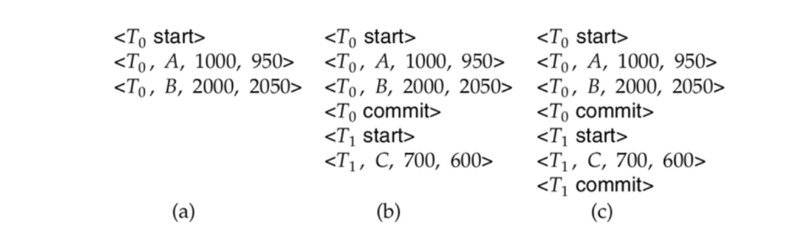
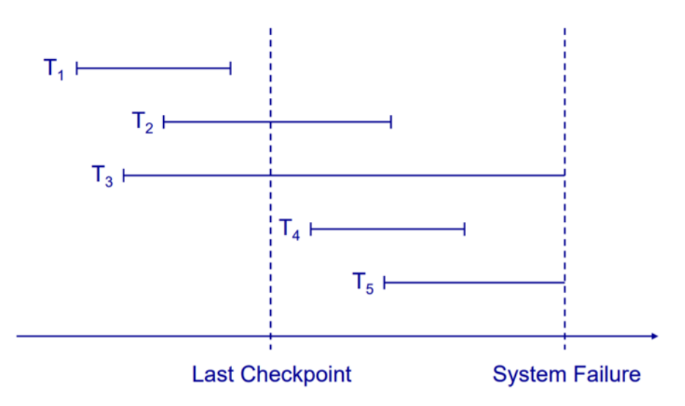
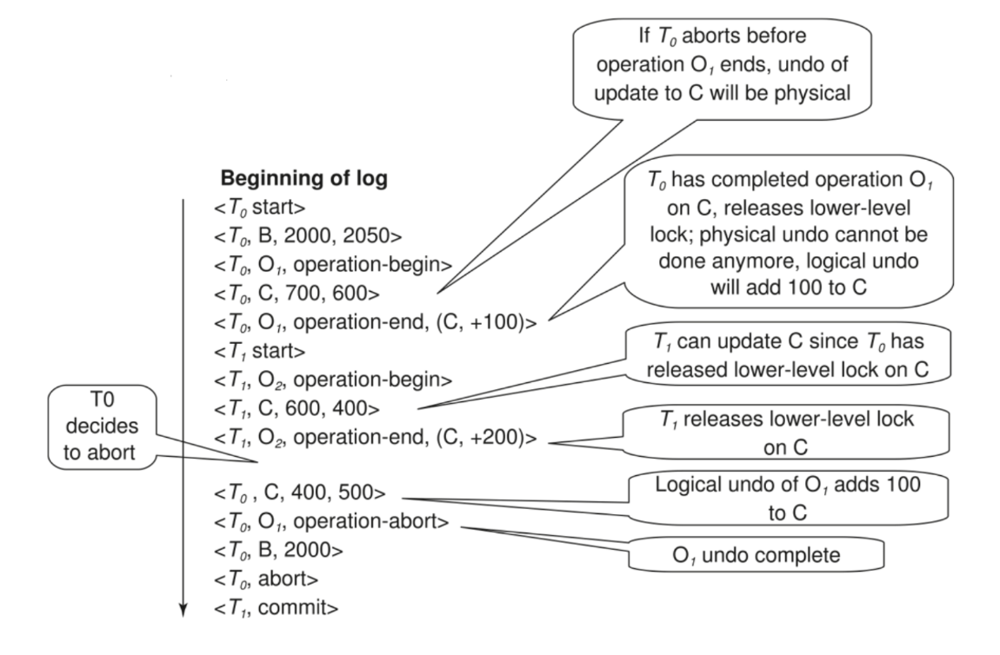
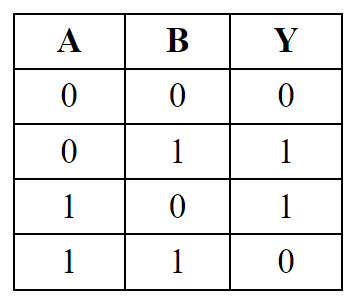
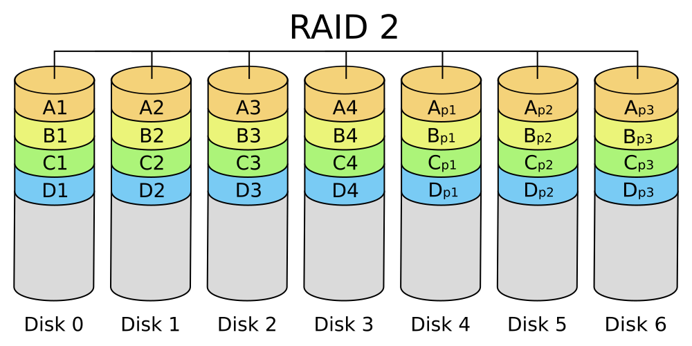
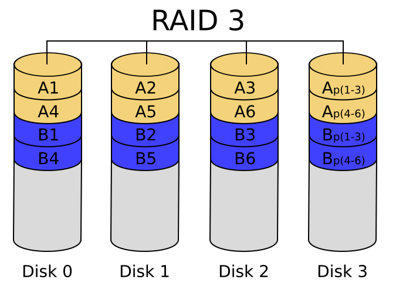
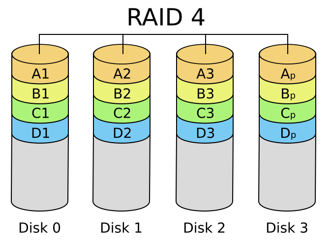
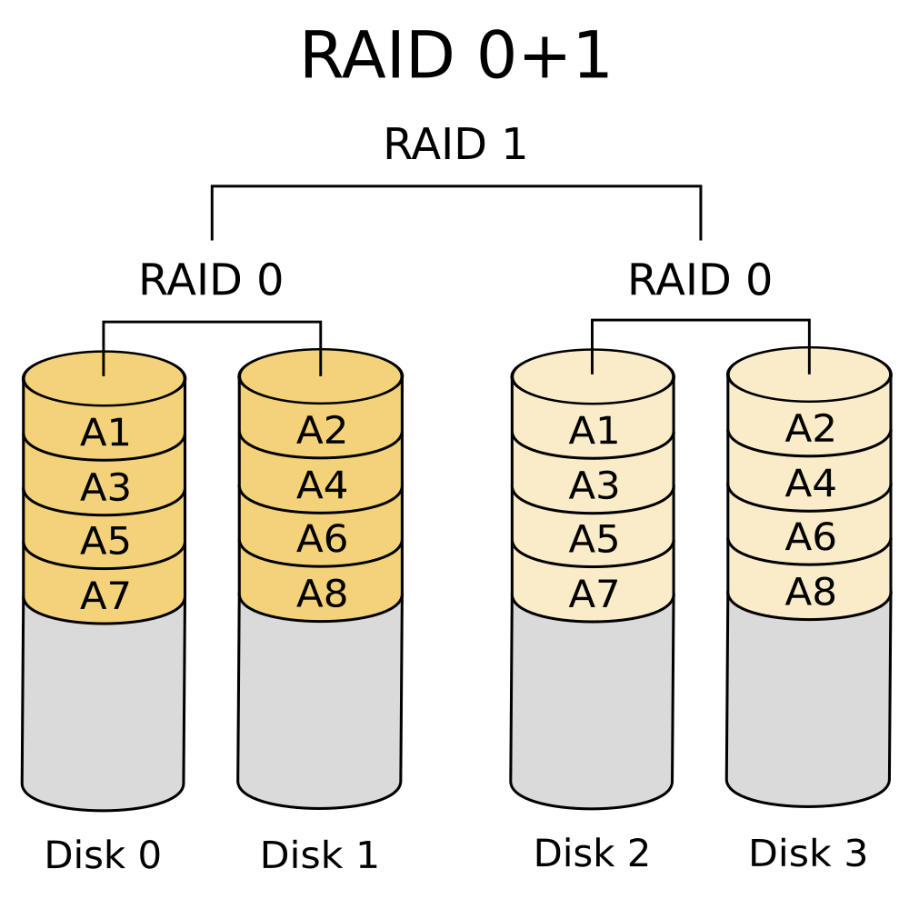

# DBMS WEEK 11

---

# Backup and Recovery

- A **Backup** of a database is a representative copy of data containing all necessary contents of a database such as data files and control files.

  - **Physical Backup:** A copy of physical database files such as data, control files, log files, and archived redo logs.
  - **Logical Backup:** A copy of logical data that is extracted from a database
consisting of tables, procedures, views, functions, etc.

- **Recovery** is the process of restoring the database to its latest known consistent state after a system failure occurs.

---

# Types of Backup Data

- **Business Data** includes personal information of clients, employees contractors etc. along with details about places, things, events and rules related to the business.

- **System Data** includes specific environment/configuration of the system used for specialised development purposes log files, software dependency data, disk images.

- **Media** files like photographs, videos, sounds, graphics etc. need backing up. Media files are typically much larger in size.

---

# Backup Strategies

- Full Backup

- Incremental Backup

- Differential Backup

- Hot Backup

---

# Full Backup

- **Full Backup** backs up everything. This is a complete copy, which stores all the objects of the database.

##### **A full backup must be done at least once before any of the other type of backup.**

    

##### Advantages

- It is relatively easy to setup, configure and maintain
- Recovery from a full backup involves a consolidated read from a single backup

##### Disadvantages
- Longest system downtime during the backup process
- It uses largest amount of storage media per backup

---

# Incremental Backup

- **Incremental backup** targets only those files or items that have changed since the last backup. **A full backup is done once a week, and incremental backups are done for the rest of the time.**

    

##### Advantages

- Less storage is used per backup
- The downtime due to backup is minimized
- It provides considerable cost reductions over full backups

##### Disadvantages
- It requires more effort and time during recovery
- It cannot be done without the full backup and intermediate incremental backup
- Recovery cannot be 100%, if any incremeantal backup is lost

---

# Differential Backup

- **Differential backup** backs up all the changes that have occurred since the most recent full backup regardless of what backups have occurred in between

    

##### Advantages

- Recoveries require fewer backup sets.
- Provide better recovery options when full backups are run rarely (for example, only monthly)

##### Disadvantages

- The amount of storage media required may exceed the storage media required for incremental backups
- If done after quite a long time, differential backups can even reach the size of a full backup

---

# Example

 

---

# Hot Backup

- **Hot backup** refers to keeping a database up and running while the backup is
performed concurrently

    

##### Advantages

- The database is always available to the end user.
- Point-in-time recovery is easier to achieve in Hot backup systems.
- Most efficient while dealing with dynamic and modularized data.

##### Disadvantages

- May not be feasible when the data set is huge.
- Fault tolerance is less.
- Maintenance and setup cost is high.

---

# Log Based Recovery

- A log is kept on stable storage
  -  The log is a sequence of log records, which maintains information about update activities on the database

- When transaction $T_i$ starts, it registers itself by writing a record $<T_i \space start>$ to the log

- Before $T_i$ executes write(X), a log record $<Ti, X, V_1, V_2>$ is written, where $V_1$ is the value of $X$ before the write (old value), and $V_2$ is the value to be written to $X$ (new value)

- When $T_i$ finishes its last statement, the log record $< T_i \space commit >$ is written.

---

# Database Modification Scheme

- The **immediate-modification** scheme allows updates of an uncommitted transaction to be made to the buffer, or the disk itself, before the transaction commits.

- The **deferred-modification** scheme performs updates to buffer/disk only at the time of transaction commit.

   

---

# Immediate Modification Recovery Example

---

# Immediate Modification Recovery Example

 

**(a)** $undo \space (T_0):$ B is restored to 2000 and A to 1000, and log records $< T_0, B, 2000 >$,
$< T_0, A, 1000 >$, $< T_0, abort>$ are written out

**(b)** $redo \space (T_0) \space and \space undo \space (T_1):$ A and B are set to 950 and 2050 and C is restored to 700. Log records $<T_1,C,700>$, $<T_1, abort>$ are written out

**(c)** $redo \space (T_0) \space and \space redo (T_1):$ A and B are set to 950 and 2050 respectively. Then C is set to 600.

---

# Checkpoints

    

 

- Ignore the transactions that has been completed before checkpoint
  - $T_1 \space can \space be \space ignored$

- Redo the transactions which has been committed after the checkpoint
  - $T_2 \space and \space T_4  \space redone$
- Undo the transaction which is not completed at the time of failure.
  - $T_3 \space and \space T_5 \space undone$

<!-- 
---

# Operational Logging

- If crash/rollback occurs before operation completes:
  - the operation-end log record is not found, and the physical undo information is used to undo operation

- If crash/rollback occurs after the operation completes:
  - the operation-end log record is found, and in this case
  - logical undo is performed using U; the physical undo information for the operation is ignored

- ##### **Redo of operation (after crash) still uses physical redo information**

---

# Example

 -->

---

# RAID

- RAID stands for **R**apid **A**rray of **I**ndependent **D**isks

- Disk organization techniques that manage a large numbers of disks, providing a view of a single disk of

  - **high capacity** and **high speed** by using multiple disks in parallel

  -  **high reliability** by storing data redundantly, so that data can be recovered even if a disk fails

   

---

# Mirroring

- Duplicate every disk. Logical disk consists of two physical disks.

- Every write is carried out on both disks but reads can take place from either disk

- If one disk in a pair fails, data still available in the other.

       

---

### Striping

#### **Bit-level Striping:**

- Split the bits of each byte across multiple disks
- Each access can read data at eight times the rate of a single disk
- But seek/access time worse than for a single disk

#### **Byte-level Striping:** 

- Each file is split up into parts one byte in size.

#### **Block-level Striping:** 
- With n disks, block i of a file goes to disk $(i \space mod \space n) + 1$
- Requests for different blocks can run in parallel if the blocks reside on different disks

---

## **Parity**

- It is a technique to provide fault tolerance and data recovery in storage systems.
- Parity information is calculated and stored along with the data
- Allows the recovery of lost data in the event of disk failure

### **XOR Gate**

---

### **Bit-Interleaved Parity:** 

- A single parity bit is enough for error correction, not just detection, since we know which disk has failed
- When writing data, corresponding parity bits must also be computed and written to a parity bit disk
- To recover data in a damaged disk, compute **XOR** of bits from other disks
(including parity bit disk)

### **Block-Interleaved Parity:** 

- Uses block-level striping, and keeps a parity block on a separate disk for corresponding blocks from n other disks
- To find value of a damaged block, compute **XOR** of bits from corresponding blocks (including parity block) from other disks

---

## RAID 0: Striping

    

- It uses data striping

- No redundant information is maintained

- Space utilization is 100 percent

-  It has the best write performance of all RAID levels

- This solution is the least costly

- Reliability is very poor

---

## RAID 1: Mirroring

    

- It maintains two identical copies of the data on two different disks.

- Every write of a disk block involves a write on both disks

- Allows parallel reads

- It does not stripe the data over different disks

- Space utilization is 50 percent

- Most Expensive solution

---

## RAID 2: Parity

    

- It uses designated drive for parity
- In RAID 2, the striping unit is a single bit (Bit-level Striping)
- **Hamming Code** is used for parity

  - Hamming codes can detect up to two-bit errors or correct one-bit errors
  - For a 4-bit data, 3 bits are added

---

## RAID 3: Byte Striping + Parity

    

- RAID 3 has a single check disk with parity information. 

- Reliability overhead for RAID 3 is a single disk, the lowest over-head possible

- It consists of byte-level striping with
dedicated parity.

- RAID-3 cannot service multiple requests simultaneously.

--- 

## RAID 4: Block Striping + Parity

    

- RAID 4 has a striping unit of a disk block instead of a single bit, as in RAID 3

- It provides good performance for data reads

- Facilitates recovery of at most 1 disk failure.

- Recovery can be made by simply **XOR**ing all the remaining data bits and the parity bit

- Write performance is low due to the need to write all parity data to a single disk

---

## RAID 5: Distributed Parity

    

- RAID 5 improves upon RAID 4 by distributing the parity blocks uniformly over all disks instead of storing them on a single check disk

- Several write requests can potentially be
processed in parallel since the bottleneck
of a unique check disk has been eliminated

- Read requests have a higher level of parallelism.

- It allows recovery of only 1 disk failure like RAID 4

---

## RAID 6: Dual Parity

    

 

- It uses block-level striping with two parity blocks distributed across all member disks.

- Write performance of RAID 6 is poorer than RAID 5 because of the increased complexity of parity calculation

- It allows recovery of upto 2 disk failure

---

## RAID 01 (RAID 0+1): Mirror of Stripes

    

 

- RAID 01 is a mirror of stripes

- It achieves both replication and sharing of data between disks

- At least four disks are required in a standard RAID 01 configuration, but larger arrays are also used.

---

## RAID 10 (RAID 1+0): Stripe of Mirrors

    

 

- RAID 10 is a stripe of mirrors

- RAID 10 is a RAID 0 array of mirrors, which may be two- or three-way mirrors, and requires a minimum of four drives

- RAID 10 provides better throughput and latency than all other RAID levels except RAID 0

---

# Example

A RAID-5 storage system with similar arrangement of parity blocks is used for storing the following data:

 

|$\space$ Disk-1 $\space$ |$\space$ Disk-2 $\space$ | $\space$ Disk-3 $\space$ |$\space$ Disk-4 $\space$|$\space$ Disk-5 $\space$|
|------|------|------|------|------|
| 0100 | XXXX | 0100 | 0001 | 0101 |
| 0101 | XXXX | 0100 | 0100 | 0001 |

     

---

## Example (Continued)

1. According to the figure disk-2 has crashed. What data is present in the two blocks of disk-2?

               

---

## Example (Continued)

2. Assume that the binary values represent 8 bit ASCII code. What is the data word
present inside this RAID-5 storage system?

               