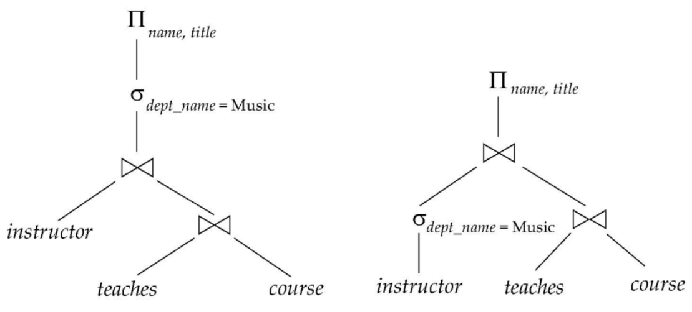

# DBMS WEEK 12

---

# Overview of Query Processing

 

---

### **Parser and Translator**

- Translate the query into its internal form. This is then translated into relational algebra.

### **Optimization**

- Optimizes the query and finds the best query based on the statistics available, it will choose the least cost

### **Evaluation**

- The query-execution engine takes a query-evaluation plan, executes that plan, and returns the answers to the query

---

# Measures of Query Cost

- Cost is generally measured as total elapsed time for answering query
  -  Many factors contribute to time cost
  -  disk accesses, CPU, or even network communication

- For simplicity we just use the **number of block transfers** from disk and the **number of seeks** as the cost measures
  - $t_T$ : time to transfer one block
  - $t_S$ : time for one seek
  - Cost for b block transfers plus S seeks

$$b ∗ t_T + S ∗ t_S$$

---

    

# Nested Loop Join

<strong>Block Transfers = $n_r \times b_s + b_r$</strong>

<strong>Seeks = $n_r + b_r$</strong>

 

# Block Nested Loop Join

<strong>Block Transfers = $b_r \times b_s + b_r$</strong>

<strong>Seeks = $2 \times b_r$</strong>

   

- $r$ - outer relation of join
- $s$ - inner relation of join
- $n_r$ - number of tuples in outer relation
- $n_s$ - number of tuples in inner relation
- $b_r$ - number of blocks in outer relation
- $b_s$ - number of blocks in inner relation

---

# Example 

| Relation | student | takes |
| -------- | ------- | ----- |
| $\space \space$ Number of tuples(n) $\space \space$ | $\space \space \space$ 5000 $\space \space \space$ | $\space \space \space$ 10000 $\space \space \space$ |
| $\space \space$ Number of blocks(b) $\space \space$| $\space \space$ 100 $\space \space$ | $\space \space \space$ 400 $\space \space \space$ |

         

---

# Example (Continued)

## Nested Loop Join

with **student** as outer relation:
- 5000 x 400 + 100 = 2,000,100 block transfers,
- 5000 + 100 = 5100 seeks

With **takes** as the outer relation
- 10000 x 100 + 400 = 1,000,400 block transfers 
- 10000 + 400 = 10,400 seeks

---

# Example (Continued)

## Block Nested Loop Join

with **student** as outer relation:
- 100 x 400 + 100 = 40,100 block transfers,
-  2 x 100 = 200 seeks

With **takes** as the outer relation
- 400 x 100 + 400 = 40,400 block transfers 
- 2 x 400 = 800 seeks

---

# Query Optimization

Select the course intructor name and title who belongs to the department 'Music'

    

 

**course** (<u>course_id</u>, title, dept_name, credits)

**instructor** (<u>ID</u>, name, dept_name, salary)

**teaches** (<u>ID, course_id, sec_id, semester</u>, year)

---

# Equivalence Rules

- Conjunctive selection operations can be deconstructed into a sequence of individual selections

$$σ_{θ_1∧θ_2}(E) = σ_{θ_1}(σ_{θ_2}(E))$$

- Selection operations are commutative

$$σ_{θ_1}(σ_{θ_2}(E)) = σ_{θ_2}(σ_{θ_1}(E))$$

- Only the last in a sequence of projection operations is needed, the others can be omitted

$$\Pi_{L_1}(\Pi_{L_2}(...\Pi_{L_n}(E)))) = \Pi_{L_1}(E)$$

---

# Equivalence Rules

- Selections can be combined with Cartesian products and theta joins

$$
σ_{θ}(E1 \times E2) = E_1 \bowtie_\theta E_2
$$

$$
\sigma_{θ_1}(E_1 \bowtie_{\theta_2} E_2) = E_1 \bowtie_{\theta_1 \wedge \theta_2 } E_2
$$

- Theta-join operations (and natural joins) are commutative

$$
E_1 \bowtie_\theta E_2 = E_2 \bowtie_\theta E_1
$$

- Natural join operations are associative

$$
(E_1 \bowtie E_2) \bowtie E_3 = E_1 \bowtie (E_2 \bowtie E_3)
$$

---

# Equivalence Rules

- Set union and intersection are associative.

$$(E_1 \cup E_2) \cup E_3 = E_1 \cup (E_2 \cup E_3)$$
$$(E_1 \cap E_2) \cap E_3 = E_1 \cap (E2 \cap E3)$$

- The set operations union and intersection are commutative.

$$E_1 \cup E_2 = E_2 \cup E_1$$
$$E_1 \cap E_2 = E_2 \cap E_1$$

#### **Set difference is not commutative**

- The projection operation distributes over union

$$\Pi_L(E_1 ∪ E_2) = (\Pi_L(E_1)) \cup (\Pi_L(E_2))$$

 

