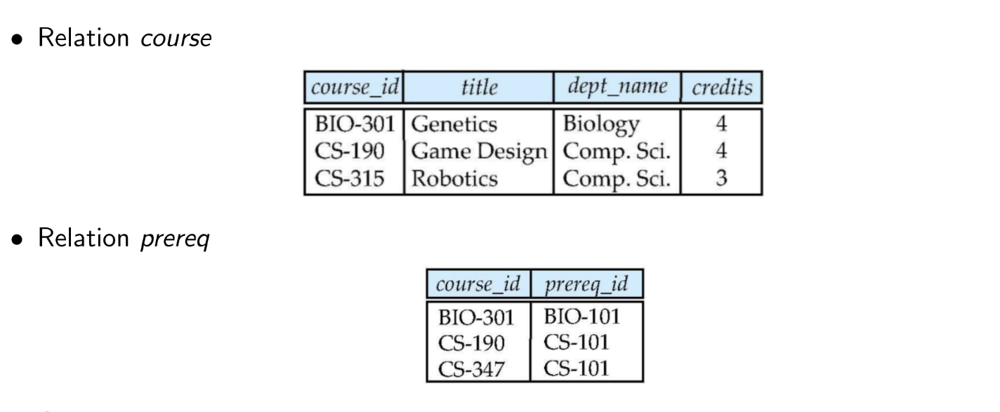

<style scoped>
    h1 {
        text-align: center;
        font-size: 70px
    }
</style>

<style>
/* Add "Page" prefix and total page number */
section::after {
  content: 'Page ' attr(data-marpit-pagination) ' / ' attr(data-marpit-pagination-total);
  font-weight: bold;
  padding: 1px;
  color: black;
  background-color: aliceblue;
}

section {
  width: 1280px;
  height: 720px;
  background-color: #fff;
  color: #333;
}

footer {
    background-color: #fff;
    color: #333;
    width: 1280px;
    height: 35px;
    font-weight: bold;
    font-size: 25px;
    background-color: aliceblue;
    padding: 1px;
}
</style>

# DBMS WEEK-3

---

# Nested Subquery

- A subquery is a `select-from-where` expression that is nested within another query.

# Some Clause

- ```5 > some(0, 5, 6)``` - **True**
- ```5 = some(0, 5, 6)``` - **True**

# All Clause


- ```7 > all(0, 5, 6)``` - **True**
- ```5 = all(0, 5, 6)``` - **False**


---

# Subqueries in `Where` Clause

<br>

```sql
select distinct course_id
from section
where semester ='Fall' and year = 2009 and
        course_id in ( select course_id
                       from section
                       where semester ='Spring'
                       and year = 2010
                     )
```


---

# Subqueries in `Where` Clause (Continued)

```sql
select name
from instructor
where salary > all (select salary
                    from instructor
                    where dept_name = 'Biology')
```

<br>

```sql
select name
from instructor
where salary > some (select salary
                     from instructor
                     where dept_name = 'Biology')
```

---

# Exist Clause

- Returns only `True` or `False`

<br>

```sql
select course_id
from section as S
where semester = 'Fall' and year = 2009 and
exists (select *
        from section as T
        where semester = 'Spring' and year = 2010
        and S.course_id = T.course_id)
```

---

# Subqueries in From Clause

<br>

```sql
select dept_name, avg_salary
from (select dept_name, avg (salary)
      from instructor
      group by dept_name) as dept_avg (dept_name,avg_salary)
where avg_salary > 42000
```
<br> <br> <br> <br>

---

# With Clause

- Used to define a temporary table that we can use in our sql

```sql
with dept_total(dept_name, value) as (
    select dept_name, sum(salary)
    from instructor
    group by dept_name
)
```

```sql
select dept_name
from dept_total
where dept_name='Finance'
```

Here, `dept_total` is a temporary table.

---

# Modification of Database

### DELETE

```sql
delete from instructor
where dept_name in (select dept_name
                    from department
                    where building = 'Watson')
```

### INSERT

```sql
INSERT into takes values (1, 'C001', 'CS', 'spring', '2022', 'S')
```

```sql
INSERT into takes (ID, course_id, sec_id, semester, year_, grade) 
values ('1', 'C001', 'CS', 'spring', '2022', 'S')
```

---

# Modification of Database (Continued)

### UPDATE

```sql
update instructor
set salary = salary ∗ 1.03
where salary <= 100000
```
<br>

```sql
update instructor
set salary = case
    when salary <= 100000
    then salary ∗ 1.05
    else salary ∗ 1.03
end
```

---

# Types of Joins

- Cross Join
- Inner Join
- Natural Join
- Left Outer Join
- Right Outer Join
- Full Outer Join
- Self Join

---

## Example Table



---

# Cross Join

- `CROSS JOIN` returns the Cartesian product of rows from tables in the join
<br>

```sql
select *
from course cross join prereq
```

<br>

```sql
select *
from course, prereq
```

---

# Inner Join

- In Inner Join, we have to specifically mention on what attribute, we are going to join the two tables

```sql
select *
from course c inner join prereq p on c.course_id=p.course_id
```
```sql
select *
from course c inner join prereq p using(course_id)
```


|course_id|title|dept_name|credits|prereq_id|course_id|
|---------|---------|---------|---------|---------|---------|
|BIO-301|Genetics|Biology|4|BIO-101|BIO-301|
|CS-190|Game Design|Comp Sci|4|CS-101|CS-190|


---

# Natural Join

- Join the two tables based on the common attribute name


```sql
select *
from course c natural join prereq p
```
<br>

|course_id|title|dept_name|credits|prereq_id|
|---------|---------|---------|---------|---|
|BIO-301|Genetics|Biology|4|BIO-101|
|CS-190|Game Design|Comp Sci|4|CS-101|
---

# Left Outer Join

- A Left outer join returns all the tuples from the left table and matching tuples from the right table.

```sql
select *
from course c left join prereq p
on e.course_id = d.course_id
```

|course_id|title|dept_name|credits|prereq_id|course_id|
|---------|---------|---------|---------|---------|---------|
|BIO-301|Genetics|Biology|4|BIO-101|BIO-301|
|CS-190|Game Design|Comp Sci|4|CS-101|CS-190|
|CS-190|Robotics|Comp Sci|3|null|null|


---

# Right Outer Join

- A Right outer join returns all the tuples from the right table and matching tuples from the left table.

```sql
select *
from course c right join prereq p
on e.course_id = d.course_id
```

|course_id|title|dept_name|credits|prereq_id|course_id|
|---------|---------|---------|---------|---------|---------|
|BIO-301|Genetics|Biology|4|BIO-101|BIO-301|
|CS-190|Game Design|Comp Sci|4|CS-101|CS-190|
|CS-347|null|null|3|CS-101|null|

---

# Full Outer Join

- A Full outer join returns all the tuples from the left table and right table.

```sql
select *
from course c full join prereq p
on e.course_id = d.course_id
```

|course_id|title|dept_name|credits|prereq_id|course_id|
|---------|---------|---------|---------|---------|---------|
|BIO-301|Genetics|Biology|4|BIO-101|BIO-301|
|CS-190|Game Design|Comp Sci|4|CS-101|CS-190|
|CS-190|Robotics|Comp Sci|3|null|null|
|CS-347|null|null|3|CS-101|null|

---

# Views

- A view provides a mechanism to hide certain data from the view of certain users.

- It's virtual table. Using this we can hide some information while giving it the users.

```sql
create view faculty as
    select ID, name, dept_name
    from instructor
```

```sql
select *
from faculty
where dept_name='Biology'
```

```sql
insert into faculty values ('30765', 'Green', 'Music');
```

---

# Materialized Views

- creates a copy of table (physically) containing all the tuples in the result of the query defining the view

- Able to access fater than `views` but have to update manually

```sql
CREATE materialized view faculty as
select ID, name, dept_name
from instructor
```

---

# Integrity Constraints

- Integrity constraints guard against accidental damage to the database, by ensuring that authorized changes to the database do not result in a loss of data consistency.

###

- **not null**
- **primary key**
- **unique**
- **check(P)**, where P is Predicate

---

# Integrity Constraints (Continued)

```sql
CREATE TABLE takes (
    ID varchar(5),
    roll_no varchar(10) unique,
    course_id varchar(8),
    sec_id varchar(8),
    semester varchar(8) not null,
    year_ numeric(4, 0),
    grade varchar(2),
    primary key (ID),
    foreign key (ID) references student,
    foreign key (course_id, sec_id, semester, year_) references section
    check semester in ('Fall', 'Winter', 'Summer', 'Spring')
)
```

---

# Referential Integrity

- Ensures that a value that appears in one relation for a given set of attributes also
appears for a certain set of attributes in another relation

### **Example**

- If 'Biology' is a department name appearing in one of the tuples in the
instructor relation, then there exists a tuple in the department relation for 'Biology'

---

# Referential Integrity (Continued)


```sql

create table course (
    course_id char(5) primary key,
    title varchar(20),
    dept_name varchar(20)
    foreign key (dept_name) references department
    on delete cascade
)

```

---

# SQL Data-types

### **Built in Data Types**

- `date` - '2005-07-27'
- `time` - '09:25:30'
- `timestamp` - '2005-07-27 09:25:30'
- `interval` - '1' day

<br>

- `interval` can be obtained by adding or subtracting from `date, time, timestamp` data types

---

# Create a Data type

```sql
create type Dollars as numeric (12,2) final
```

- `final` is the keyword to denote user-defined data-type.

<br>

```sql
create table department (
    dept_name varchar (20),
    building varchar (15),
    budget Dollars
)
```

---

# Domains

```sql
create domain person_name char(20) not null
```

<br>

```sql
create table Person (
    name person_name,
    email varchar(50) unique not null,
    mobile numeric(10, 0) unique not null,
    address varchar(300)
)
```

Here, `person_name` user defined custom domain.

---

# Large Binary Objects

### **BLOB** (Binary Large Objects)

- BLOBs are used to store binary data, such as images, audio/video files, documents, or any other type of binary data.

### **CLOB** (Character Large Objects)

- CLOBs are used to store large amounts of character data, such as text documents, XML data, JSON data, or any other type of textual data.

---

# Authorization

### **Previleges in SQL**

- **select** -  allows read access to relation, or the ability to query using the view

- **insert** - the ability to insert tuples
- **update** - the ability to update using the SQL update statement
- **delete** - the ability to delete tuples.
- **all privileges** -  used as a short form for all the allowable privileges

---

# Authorization (Continued)

### **grant**

```sql
grant <privilege list>
on <relation_name or view_name> to <user list>
```

### **revoke**

```sql
revoke <privilege list>
on <relation_name or view_name> from <user list>
```

---

# Authorization (Continued)

### **Roles**

```sql
create role instructor
grant instructor to <user>
```

### **Views**

```sql
create view instructor_view as (
    select *
    from instructor
    where subject='DBMS'
)
```

```sql
grant select, update, delete on instructor_view to instructor 
```

---

# SQL Functions

### **Syntax of SQL Function**

```sql
create or replace function function_name(arguments) 
returns <return_datatype>
as $$
    declare
      <variable declaration>
      
    begin
      <function_body>
      
     return <variable_name>
   END; 
   $$
LANGUAGE plpgsql;
```
---

# Example of SQL function (1)

```sql
create function dept_count (dept_name varchar(20))
returns int
as
$$
declare d_count integer;
begin
    select count (*) into d_count
    from instructor
    where instructor.dept_name = dept_name
    return d_count;
end;
$$ language plpgsql
```

```sql
select dept_name, budget
from department
where dept_count (dept_name) > 12
```
---

# Example of SQL function (2)

```sql
create function instructor_of(dept name char(20))
returns table (
        ID varchar(5),
        name varchar(20),
        dept name varchar(20)
        salary numeric(8, 2) 
    )
returns table
    (
        select ID, name, dept_name, salary
        from instructor
        where instructor.dept_name = instructor_of.dept_name
    )
```

```sql
select *
from table (instructor_of('Music'))
```


---

# Triggers

- A trigger defines a set of actions that are performed in response to an insert, update, or delete operation on a specified table.

There are two types of triggers.

- **Row level trigger** - trigger fires once for each row that is affected by a triggering event.

- **Statement level trigger** - trigger fires only once for each statement.

---

# Syntax of Trigger

<br>

```sql
create trigger <trigger_name>
before insert on <table_name>
for each <row>/<statement>
execute procedure <call_function>;
```

<br>

```sql
create trigger salary_trig
before insert on Employee
for each row
execute procedure salary_func();
```

---

# Example for Trigger

```sql
create or replace function salary_func() return trigger as
$$
Declare
  counter int :=0
Begin
  if new.esalary > 75000 then
    counter = counter + 1
  end if;
  return new;
end;
$$ language plpgsql
```

<br>

