

# DBMS WEEK 4

---

# Division Operation

 

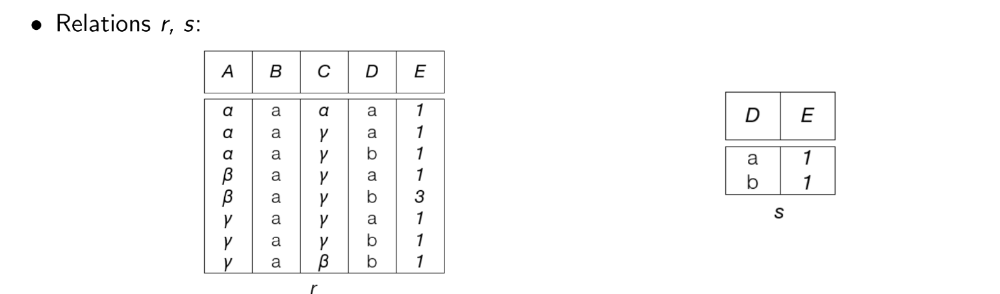

---

# Division Operation (Continued)

 

$r \div s$

 

|A|B|C|
|-|-|-|
|$\alpha$|a|$\gamma$|
|$\gamma$|a|$\gamma$|

---

# Relational Algebra

It's a procedural query language

- $\sigma$ - Select
- $\pi$ - Project
- $\neg$ - Negation (not)
- $\cup$ - Union
- $\cap$ - Intersection
- $\times$ - Cartestion Product
- $-$ - Set Difference (Except)
- $⋈$ - Natural Join

---

# Example

1. Find all the names of students whose age is greater than 25, or who are enrolled in Maths

$$\pi_{Name}(\sigma_{Age<25 \space \lor \space Subject='Maths'}(Students))$$

 

2. Find the name and sports of the student whose age is less than 25 and awards is greater than 3

$$\pi_{Name, Sports}(\sigma_{Age<25 \space \land \space Awards>3}(Students ⋈ Activity))$$

---

# Tuple Relational Calculus

 

- TRC is a non-procedural query language, where each query is of the form

 

$$\{t \space | \space P(t)\}$$

where **t** = resulting tuples,

P(t) = known as predicate and these are the conditions that are used to fetch t.

---

# Example

1. Find the name of the students whose age is 21

 

$$ \{t \space | \space \exists \space s \in students (t.name=s.name ∧ s.age=21) \} $$

 

2. Find the name of the employees who works in department manufacturing

**employee(_id_, name, salary)**
**department(_id_, d_id, name, building)**

 

$$ \{M \space | \space \exists \space E \in employee \space \exists \space D \in department ( E.id=D.id ∧ D.name='Manufacturing' \land M.name=E.name) \} $$
---

# Domain Relational Calculus

 

- A non-procedural query language equivalent in power to the tuple relational calculus
- Each query is an expression of the form:

$$\{ <x_1, x_2, ... ,x_n> \space | \space P(x_1, x_2, ... , x_n)\}$$

- $x_1, x_2, ... , x_n$ represent domain variables
- P represents a formula similar to that of the predicate calculus

---

# Example

1. Find the name of the students whose age is 21

**student(name, age, marks)**

 

$$ \{<a> | \space \exists \space b \space (<a,b,c> \in students \space \land \space b=21)  \} $$

 

2. Find the name of the employees who works in department manufacturing

**employee(_id_, name, salary)**
**department(_id_, d_id, name, building)**
 

$$ \{ <b> |\space \exists \space a,b,c  \space (<a, b, c> \in employee) \space \land \space \exists \space y \space (<a, x, y, z> \in department \space \land y='Manufacturing') \} $$

---

# Entity Sets

 
 

- An **entity** is an object that exists and is distinguishable from object.

- An **entity set** is a set of entities of the same type that share the same properties

---

# Strong Entity set

- A strong entity set is an entity set that contains sufficient attributes to uniquely identify all its entities.
- A primary key exists for a strong entity sets

# Weak Entity Set

- A weak entity set is an entity set that does not contain sufficient attributes to uniquely identify its entities.
- A primary key does not exists for a weak entity set
- However, it contains a partial key called as a **discriminator**
- **Discriminator** represented by underlining with a dashed line.

---

# Weak Entity set (continued)

- Weak entity set cannot exist independently since it doesn't have primary key

- It features in the model in relationship with a strong entity set. This is called the **identifying relationship**

- **Primary key of weak entity set = Discriminator + Primary key of Strong entity set**

- It must have **total participation** and **identifying relationship**

---

# Attributes

- An attribute is a property associated entity set.

### Types of attributes

- Simple attribute
- Composite attribute - **Eg** - fname, mname, lname can consits in a name
- Single-valued attribute
- Multivalued attribute - **Eg** - **{phone_numbers}**
- Derived attribute - **Eg** - **age()** from date of birth

--- 

# Example

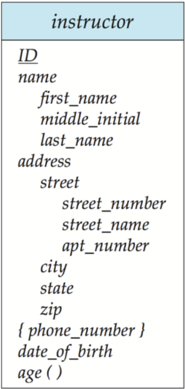

---

# ER Diagram

- Rectangles represent entities
- Attributes are listed inside the rectangle
- Underline indicates primary key
- Diamond represent relationship set
- Total Participation (indicated by double line)
- Weak entity set represented by double rectangle

---

# One to One relationship

- Each instructor has atmost one student
- Each student has atmost one instructor

 

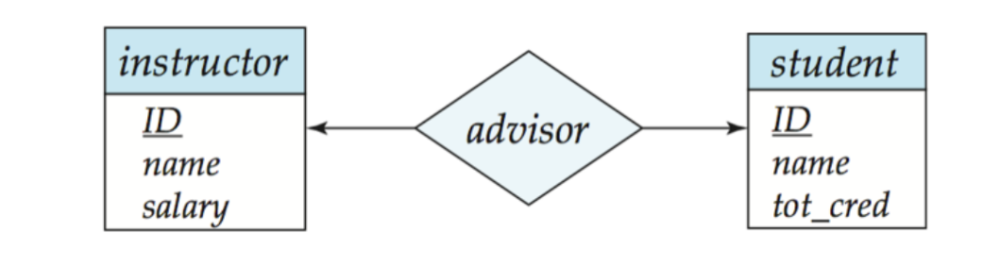

---

# One to Many relationship

- Each instructor has one or many students
- Each student has at most one instructor

 

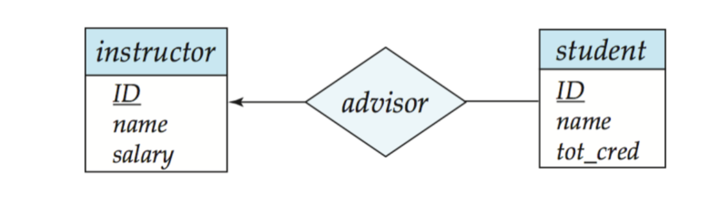

---

# Many to one relationship

- Each instructor has at most one student
- Each student has one or many instructors

 

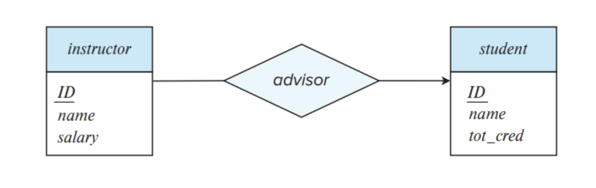

---

# Many to Many relationship

- Each instructor has one or many students
- Each student has one or many instructors

 

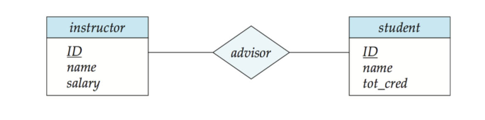

---

# Total and Partial Participation

- Every student must have an instructor
- Instructor may or may not have a student

 

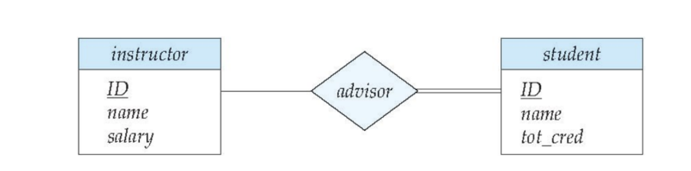

---

# Expressing weak entity set

 

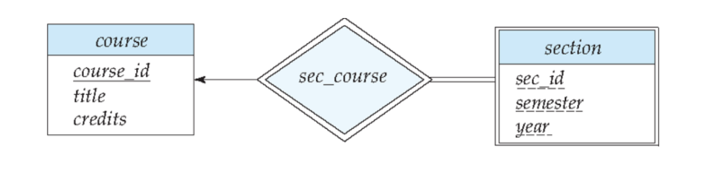

---

# Ternary Relationship

 

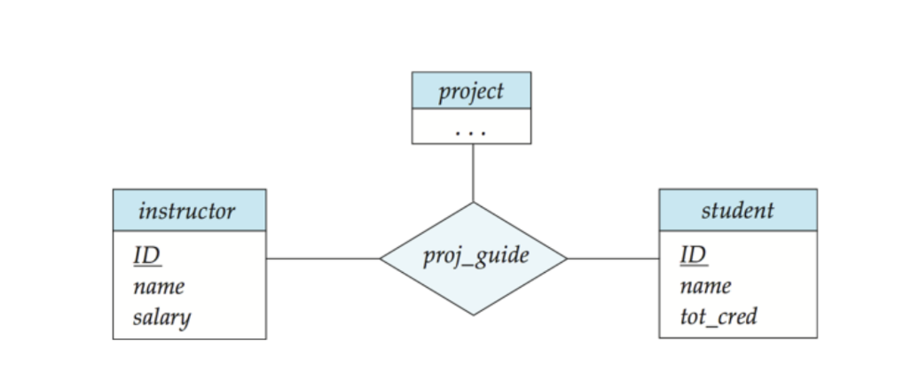

---

# Aggregation

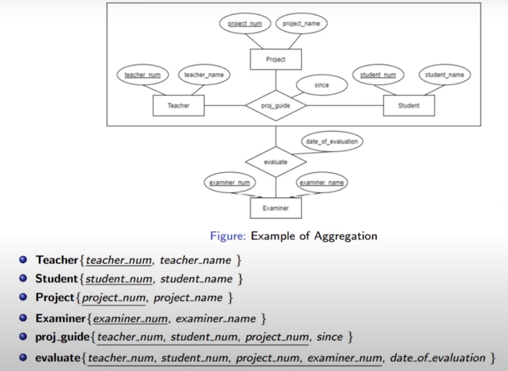

---

# Overlapping and Partial

- A person can be either student or faculty or both.
- There may be some persons who are just persons not belongs to faculty and students 

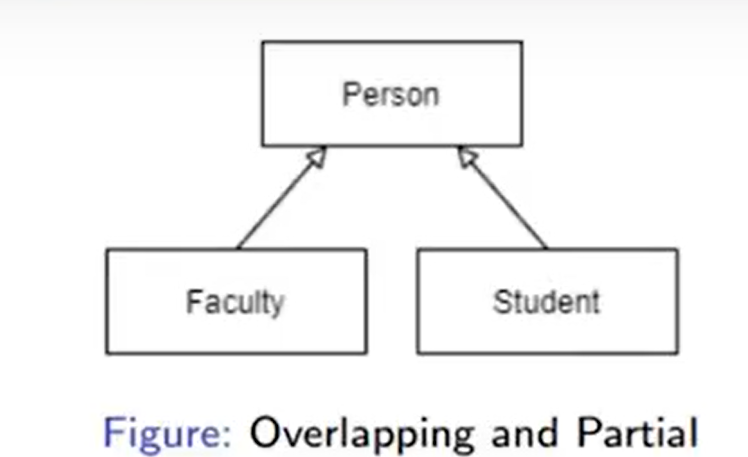

---

# Disjoint and Partial

- A Student can be either UG students or PG students but they cannnot be both UG and PG students

- There may be students who are just students not belongs both UG and PG students

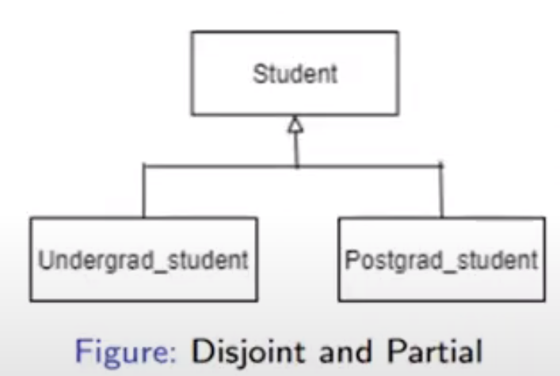

---

# Disjoint and Complete

- Every Part must be present in either Purchased part or Manufactured part

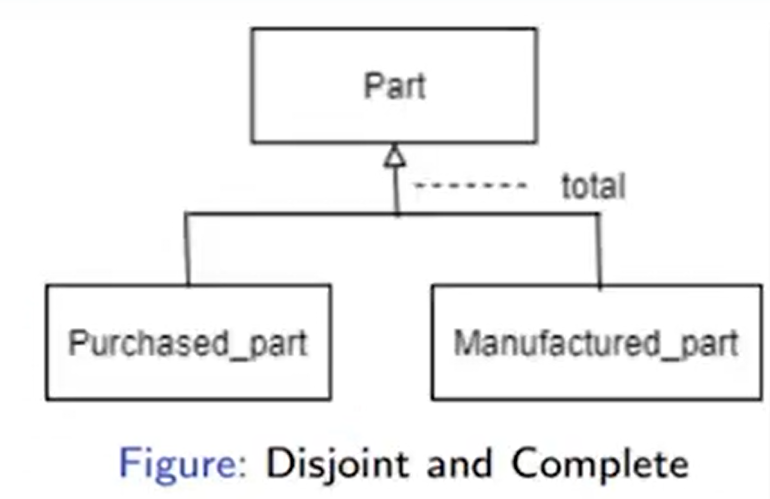

---

# Summary

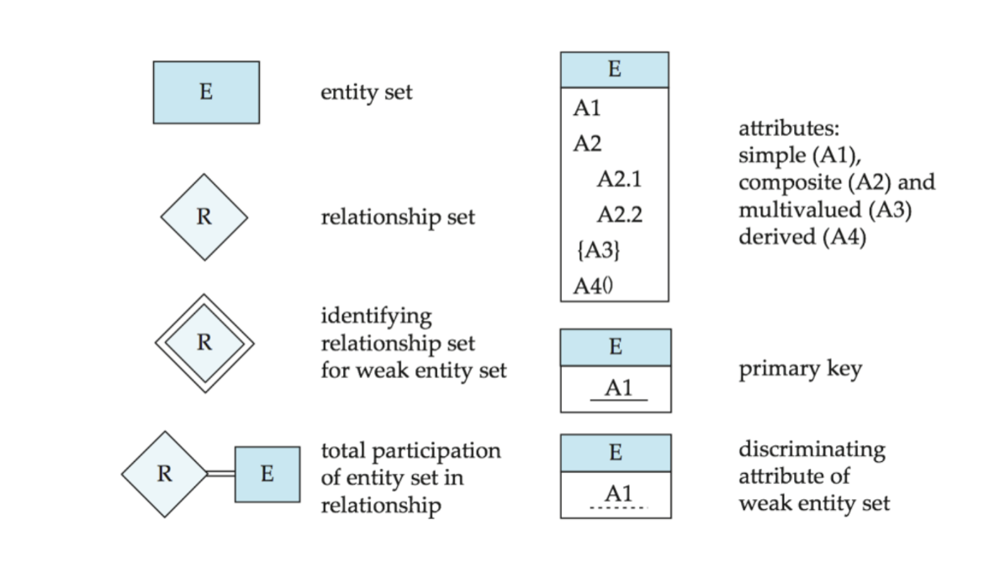

