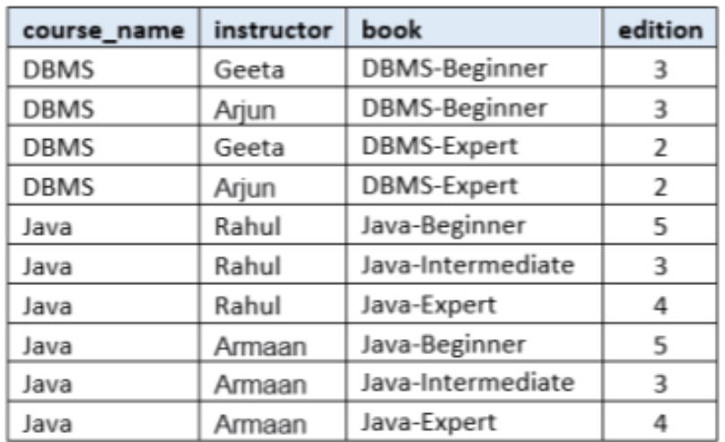

# DBMS WEEK 6

---

# Normalization and Normal Forms

- Normalization or Schema Refinement is a technique of organizing the data in the database

- Normalization is used for mainly two purpose:
  - Eliminating redundant (useless) data
  - Ensuring data dependencies 

 

- A normal form specifies a set of conditions that the relational schema must satisfy in terms of its constraints

---

# 1NF (First Normal Form)

- All Domains should only have Atomic Values
- No Multivalued attributes

### **Example**

|SID|Sname|Cname|
|---|-----|-----|
|S1 | A | C, C++ |
|S2 | B | C++, DB |
|S3 | C | DB |

- *Cname* is a multivalued attribute. So, the above table is not in *1NF*

---

# 2NF (Second Normal Form)

Relation R is in Second Normal Form (2NF) only if

- R is in 1NF and
- R contains no Partial Dependency

## **Partial Dependency**

$A → B$ is a Partial dependency only if

- A - Proper subset of Candidate Key
- B - Non Prime Attribute

---

# Example

Consider $R(A, B, C, D, E, F)$ and its $FD=\{AB→CDE, \space E→F, \space BF→A, \space C→B\}$

         

---

# 3NF (Third Normal Form)

A relational schema R is in 3NF if for every FD $A → B$ associated with R either

- R is in 2NF and
- $B \subseteq A$ (Trivial FD) (or)
- A is a superkey of R (or)
- B is a prime attribute

### **Note:**

- 3NF preserves both dependency preservation and lossless join decomposition

---

# Example

Consider $R(A, B, C, D, E, F)$ and its $FD=\{AB→CDE, \space E→F, \space BF→A, \space C→B\}$

         

---

# BCNF (Boyce – Codd Normal Form)

A relational schema R is in BCNF if for every FD $A → B$ associated with R either

- R is in 3NF and
- A must be a superkey (or)
- $B \subseteq A$ (Trivial FD)

### **Note:**

- BCNF decomposition is lossless
- BCNF decomposition is may or may not be dependency preserving

---

# Example

Consider $R(A, B, C, D)$ and its $FD=\{A→B, \space B→C, \space C→D, \space D→A\}$

         

---

# MVD (Multivalued Dependency)

Let R be a relation schema and $\alpha \subseteq  R$ and  $\beta \subseteq  R$. The multivalued dependency $α \twoheadrightarrow \beta$

holds on R if in any legal relation $r(R)$, for all pairs for tuples $t1$ and $t2$ in r such that
$t1[α] = t2 [α]$, there exist tuples t3 and t4 in r such that:

- $t1[\alpha]=t2[\alpha]=t3[\alpha]=t4[\alpha]$
- $t1[\beta]=t3[\beta]$ $\space$ and $\space$ $t2[\beta]=t4[\beta]$
- $t2[R–β]=t3[R–β]$ $\space$ and $\space$ $t1[R – β]=t4[R–β]$

---

# MVD (Continued)

 

For MVD,

- Total number of attributes should be more than two

- If there exist 3 attributes, then 2 attributes must be independent of each other

---

# MVD Theory

| Name | Rule |
| ---- | ---- |
| Complementation | If $X \twoheadrightarrow Y$, then $X \twoheadrightarrow (R − (X ∪ Y))$ |
| Augmentation | If $X \twoheadrightarrow Y$ and $W ⊇ Z$, then $WX \twoheadrightarrow YZ$ |
| Transitivity | If $X \twoheadrightarrow Y$ and $Y \twoheadrightarrow Z$, then $X \twoheadrightarrow (Z−Y)$|
| Replication | If $X \rightarrow Y$, then $X \twoheadrightarrow Y$ but the reverse is not true |
| Coalescence | If $X \twoheadrightarrow Y$ and there is a W such that $W ∩ Y$ is empty, $W → Z$ and $Z \subseteq Y$, then $X → Z$ |

---

# Example

|SId|Sname|Course|Instructor|Inst_Room|
|----|----|----|----|----|
|ME1001|David|Python|MK Singh|503|
|ME1001|David|Java|SN Joseph|505|
|ME1001|David|Python|SN Joseph|505|
|ME1001|David|Java|MK Singh|503|

 

- \{SId, Sname\} $\twoheadrightarrow$ Course
- SId $\twoheadrightarrow$ \{Instructor, Inst\_Room\}

---

# Example

- course\_name $\twoheadrightarrow$ instructor
- course\_name $\twoheadrightarrow$ \{book, edition\}

---

# Trivial MVD

 

A MVD $X \twoheadrightarrow Y$ in R is called a trivial MVD is

- Y is a subset of X $(Y \subseteq X)$ (or)
- $X ∪ Y = R$

 

### Example

- $AB \twoheadrightarrow B$ (trivial MVD)

---

# 4NF (Fourth Normal Form)

 

A relation schema R is in 4NF if and only if the following conditions are satisfied

- R is in BCNF and
- Should not have any multi-valued dependency

    
