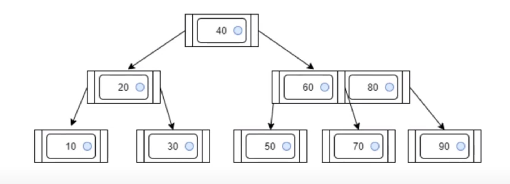
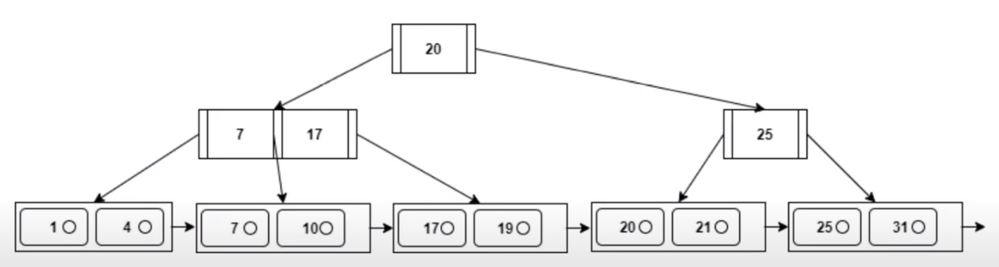

<style scoped>
    h1 {
        text-align: center;
        font-size: 70px
    }
</style>

<style>
/* Add "Page" prefix and total page number */
section::after {
  content: 'Page ' attr(data-marpit-pagination) ' / ' attr(data-marpit-pagination-total);
  font-weight: bold;
  padding: 1px;
  color: black;
  background-color: aliceblue;
}

section {
  width: 1280px;
  height: 720px;
  background-color: #fff;
  color: #333;
}

footer {
    background-color: #fff;
    color: #333;
    width: 1280px;
    height: 35px;
    font-weight: bold;
    font-size: 25px;
    background-color: aliceblue;
    padding: 1px;
}
</style>


# DBMS WEEK 9

---

<style scoped>
    table {
        display: flex;
        align-items: center;
        justify-content: center;
        margin-left: 360px;
    }
</style>

# Indexing

- Indexing mechanisms used to speed up access to desired data.

- An index file consists of records (called index entries) of the form


| search-key |  pointer |
|-|-|

## **Types of Indices**

- **Ordered indices** - search keys are stored in sorted order
- **Hash indices** - search keys are distributed uniformly across buckets using a hash
function

---


# Ordered Indices

- In an ordered index, index entries are stored sorted on the search key value.

### **Primary index** 
- In a sequentially ordered file, the index whose search key specifies the sequential order of the file
-  Also called **clustering index**


### **Secondary index** 
- An index whose search key specifies an order different from the sequential order of the file
- Also called **non-clustering index**

---

<style scoped>
    .container {
        display: flex;
        flex-wrap: wrap;
        justify-content: space-between;
    }
    
    .column_1 {
        width: 30%;
        margin-bottom: 20px; 
    }

    .column_2 {
        width: 70%; 
        margin-bottom: 20px; 
    }
</style>


<div class="container">
    <div class="column_1">

# Dense Index
- Index record appears for every search-key value in the file.
<br>

# Sparse Index

- It contains index records only some search-key values.
- Applicable when records are sequentially ordered on search-key.


</div>
    <div class="column_2">
        <br>
        
        <center><i></i></center> 
        
        <center><i></i></center> <br>
    </div>
</div>

--- 

<style scoped>
    .container {
        display: flex;
        flex-wrap: wrap;
        justify-content: space-between;
    }
    
    .column_1 {
        width: 25%;
        margin-bottom: 20px; 
    }

    .column_2 {
        width: 75%; 
        margin-bottom: 20px; 
    }
</style>

<div class="container">
    <div class="column_1">

# Multilevel Indexing

- If primary index does not fit in memory, access becomes expensive.

- Treat primary index kept on disk as a sequential file and construct a sparse index on it.

  - **outer index** – a sparse index of primary index
  - **inner index** – the primary index file


</div>
    <div class="column_2">
        <br>
        
        <center><i></i></center> <br>
    </div>
</div>


---

# Some Formulas for solving the problem

<br>

- $Space \space of \space index = (size \space of \space key \space field + Pointer \space field)$

- $Required \space space \space to \space store \space all \space the \space index = space \space of \space index \times no. of records$

- $One \space Block \space size = \frac{size \space of \space file}{no. \space of \space block \space used \space stored \space the  \space file}$

- $No. \space of \space blocks \space required to \space store \space the \space index = \frac{space \space occupied \space by \space the \space indicies}{one \space block \space size}$


<br> <br>

---

# B Tree

Construct a 3 order $B$ Tree from the key values inserted sequentially

20, 50, 40, 80, 90, 10, 30, 70, 60

<br> <br> <br> <br> <br> <br> <br> <br>
2
---

# Solution



---

# B+ Tree

Construct a 4 order $B^+$ Tree from the key values inserted sequentially

1, 4, 7, 10, 17, 21, 31, 25, 19, 20

<br> <br> <br> <br> <br> <br> <br> <br>

---

<style scoped>
    img {
        height: 450px;
    }
</style>


# Solution



---

<style scoped>
    h1 {
        font-size: 35px;
    }
</style>

# Difference between B Tree and B+ Tree

<table>
<thead>
<tr>
<th>Basis of Comparison</th>
<th>B tree</th>
<th>B+ tree</th>
</tr>
</thead>
<tbody>
<tr>
<td><strong>Pointers</strong></td>
<td>All internal and leaf nodes have data pointers</td>
<td>Only leaf nodes have data pointers</td>
</tr>
<tr>
<td><strong>Redundant Keys</strong></td>
<td>No duplicate of keys is maintained in the tree.</td>
<td>Duplicate of keys are maintained and all nodes are present at the leaf.</td>
</tr>
<tr>
<td><strong>Leaf Nodes</strong></td>
<td>Leaf nodes are not stored as structural linked list.</td>
<td>Leaf nodes are stored as structural linked list.</td>
</tr>
<tr>
<td><strong>Tree</strong></td>
<td>B Tree may or may not be balanced.</td>
<td>
B<sup>+</sup> Tree is always balanced.
</td>
</tr>
</tbody>
</table>

---

## **Facts about $B$ and $B^+$ Tree**

- **2 Order Tree** - 1 node & 2 child
- **3 Order Tree** - 2 node & 3 child
- **4 Order Tree** - 3 node & 4 child

<br>

A non-root node of a $B$ tree has

- min. number of child-node pointers = $\lceil \frac{p}{2}\rceil$,

- min. number of keys = $\lceil \frac{p -1}{2}\rceil$.

A Internal node of a $B^+$ tree has

- atleast $\lceil \frac{p}{2}\rceil$ child pointers and at most $p$ pointers

<br>

---

<style>
    .container {
        display: flex;
        justify-content: space-between;
    }

    .column_1 {
        flex: 2;
    }

    .column_2 {
        flex: 1;
        position: sticky;
        top: 0; /* Adjust this value as per your design */
    }
</style>

# Bitmap Indices

<br>

<div class="container">
    <div class="column_1">
        <table>
            <thead>
                <tr>
                    <th>ID</th>
                    <th>Gender</th>
                    <th>Income Level</th>
                </tr>
            </thead>
            <tbody>
                <tr>
                    <td>76766</td>
                    <td>m</td>
                    <td>L1</td>
                </tr>
                <tr>
                    <td>22222</td>
                    <td>f</td>
                    <td>L2</td>
                </tr>
                <tr>
                    <td>12121</td>
                    <td>f</td>
                    <td>L1</td>
                </tr>
                <tr>
                    <td>15151</td>
                    <td>m</td>
                    <td>L4</td>
                </tr>
                <tr>
                    <td>58583</td>
                    <td>f</td>
                    <td>L3</td>
                </tr>
            </tbody>
        </table>
    </div>
    <div class="column_2">
        <h3>Bitmaps for Gender</h3>
        <table>
            <thead>
                <tr>
                    <th>Gender</th>
                    <th>Bits</th>
                </tr>
            </thead>
            <tbody>
                <tr>
                    <td>m</td>
                    <td>10010</td>
                </tr>
                <tr>
                    <td>f</td>
                    <td>01101</td>
                </tr>
            </tbody>
        </table>
    </div>
</div>

---

# Index in SQL

Consider a Relation: **Student (Student\_ID, Name, Address, Age, Gender, Semester)**


### Create Index

```sql
CREATE INDEX idx_stud ON Student (name, address)
```

### Drop Index


```sql
DROP INDEX idx_stud
```

### Bitmap Index

```sql
CREATE BITMAP INDEX idx_Gender ON Student (Gender)
```

---

# Rules for Indexing

- Indexes lead to Access – Update Tradeoff
- Index the Correct Tables
- Index the Correct Columns
- Limit the Number of Indexes for Each Table
- Choose the Order of Columns in Composite Indexes
- Gather Statistics to Make Index Usage More Accurate
- Drop Indexes That Are No Longer Required


